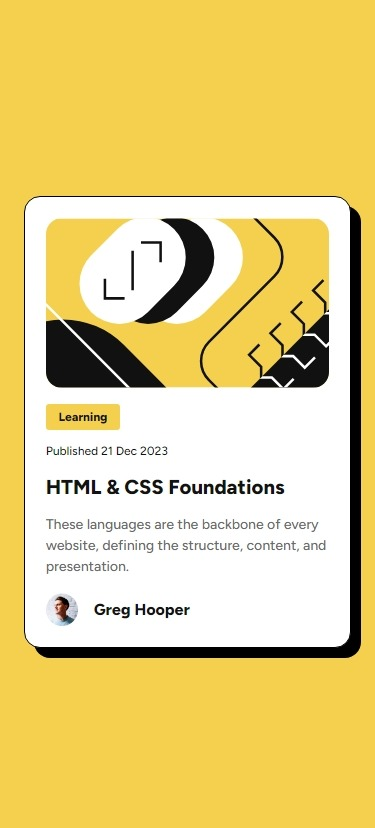
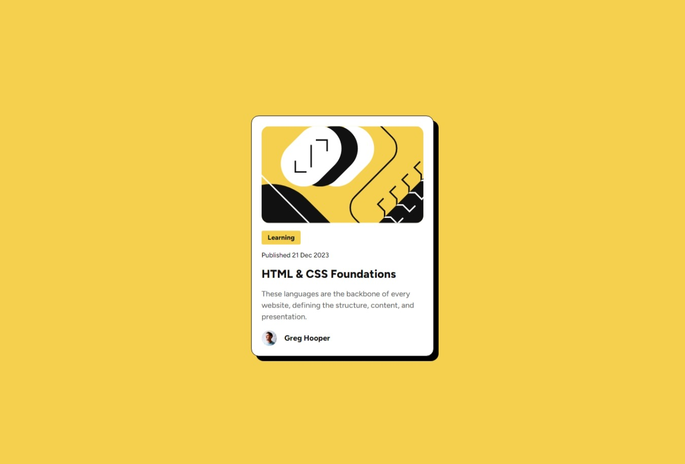

# Frontend Mentor - Blog preview card solution

This is a solution to the [Blog preview card challenge on Frontend Mentor](https://www.frontendmentor.io/challenges/blog-preview-card-ckPaj01IcS). Frontend Mentor challenges help you improve your coding skills by building realistic projects. 

## Table of contents

- [Overview](#overview)
  - [The challenge](#the-challenge)
  - [Screenshots](#screenshots)
  - [Links](#links)
- [My process](#my-process)
  - [Built with](#built-with)
  - [What I learned](#what-i-learned)
  - [Continued development](#continued-development)
- [Author](#author)

**Note: Delete this note and update the table of contents based on what sections you keep.**

## Overview

### The challenge

Users should be able to:

- See hover and focus states for all interactive elements on the page

### Screenshots

### Links

- Solution URL: [Solution URL](https://github.com/alexrtm/blog-preview-card)
- Live Site URL: [live site URL](https://alexrtm.github.io/blog-preview-card)

## My process

### Built with

- Semantic HTML5 markup
- CSS custom properties
- Flexbox
- CSS Grid
- Mobile-first workflow

### What I learned
The main thing I learned in this project was responsive typography using clamp(). This allowed me to add responsive typography without the need for excessive media queries. 

### Continued development

-Dive deeper into CSS Grid and Flexbox to create complex, responsive layouts. Practice building multi-column layouts, complex grids, and alignments.
-CSS Animations: Explore CSS animations and transitions to add subtle effects to web pages. In particular use animations for loading states, hover effects, and modal transitions.
-Responsive Design: Explore responsive design patterns, like fluid grids, adaptive typography, and responsive images (`picture` element, srcset).
-Accessibility: Deepen understanding of web accessibility (a11y). Learn about ARIA (Accessible Rich Internet Applications) attributes and how to implement accessible forms, navigation, and media.

## Author

- Frontend Mentor - [@alexrtm](https://www.frontendmentor.io/profile/alexrtm)

